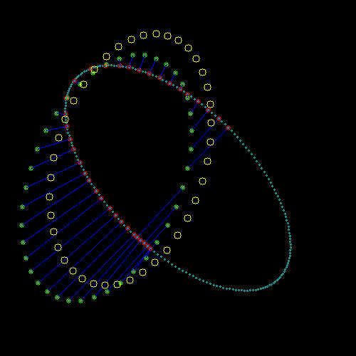

icp-opencv 
==========

A simple example of icp (Iterative Closest Point) with [opencv](http://opencv.org/) and [kdtree](https://code.google.com/p/kdtree/).

[https://www.youtube.com/watch?v=tfckXoa-wRQ](https://www.youtube.com/watch?v=tfckXoa-wRQ)

Install 
=========

Generate the project with [cmake](http://www.cmake.org/) :

### Windows (Visualstudio)  

Example for visual 2008 in console in directory project :
 
      > mkdir visual2009
      > cd visual2009
      > cmake .. -G"Visual Studio 9 2008"

Or launch the bat file `create_project_studio2010.bat` for visual studio 2010

### MacOS (Xcode)

launch the shell file `create_project_xcode.sh`, verify that the file is executable else : `> chmod 755 create_project_xcode.sh`.

### Linux (Makefiles)

      > mkdir makeproject
      > cd makeproject
      > cmake .. -G"Unix Makefiles"
      > make

